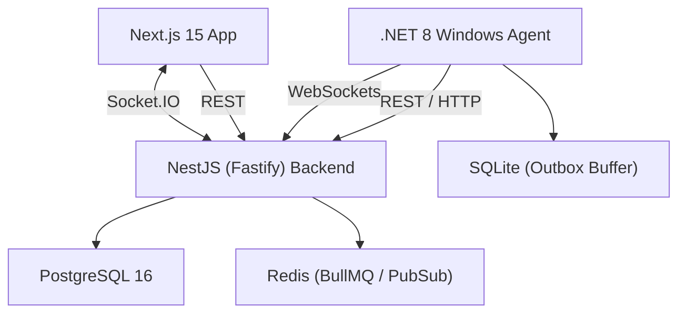

# Access Summary

- **Analyzed:** Root structure, `package.json` files, `docker-compose.yml`, `README.md`, Prisma Schema, Backend Modules structure, Agent codebase structure, Implementation Journal, and recent Git logs.
- **Not Analyzed:** In-depth execution flow of every frontend component and granular unit test files (would exceed practical limits without specific direction, but architecture and stack were fully verified).
- **Missing Access:** Physical runtime environment logs (app must be booted to verify dynamic state), live DB connections (though Prisma schema serves as source of truth for structure).

# Confidence Summary

- **High Confidence:** Tech stack, architecture, database schema, infrastructure, recent git commits, and the device registration workflow.
- **Medium Confidence:** Feature completion percentages (inferred from Prisma schema coverage and `IMPLEMENTATION_JOURNAL.md`).
- **Low Confidence:** AI Agent orchestration. No AI/LLM integration logic was found in the codebase. The ".NET Agent" refers to a system-level telemetry daemon, not an LLM Agent.

# Critical Findings

1. **The "Agent" is a System Service, not an AI:** The "Agent" mentioned in the repository is a `.NET 8` Windows daemon designed to collect system telemetry (CPU, RAM, Disk, Network) and buffer it using SQLite. It is **not** an AI/LLM agent.
2. **Enterprise Grade Multi-Tenant Architecture:** Despite being for "Personal Use / Home Lab", the Prisma schema contains full enterprise SaaS multi-tenancy capabilities (`Organization`, `Role`, `AlertBreachState`, `MaintenanceWindow`).
3. **Module 2 Pending Field Validation:** The backend and agent registration vertical slice (Zero-Touch Provisioning) was recently completed and tested via automated suites, but is pending physical hardware validation due to previous `LocalSystem` vs `Admin` credential partitioning bugs.

---

# SECTION 1: EXECUTIVE PROJECT SUMMARY

**Project Name:** NOS — Network Operating System
**Description:** NOS is a developer-grade monitoring dashboard and Remote Monitoring and Management (RMM) platform built to track devices in a home lab or enterprise network. A lightweight .NET agent runs on Windows PCs to collect rich hardware, software, and telemetry metrics, sending them to a high-performance Fastify backend. The data is visualized on a modern Next.js 15 dashboard.
**Problem it solves:** Provides comprehensive, real-time observability into hardware performance, system health, and software inventory without relying on heavy commercial SaaS RMMs.
**Target Users:** Developers, Home Lab Enthusiasts, IT Administrators.
**Main Capabilities:** Real-time system monitoring, asset discovery (hardware/software inventory), zero-touch provisioning via registration keys, real-time telemetry over WebSockets, and a robust rule-based alerting engine.
**Completion Estimate:** 65% (Core architecture and device registration complete; frontend dashboards and advanced alerting still in active stabilization).
**Technical Maturity:** Beta (Conditionally Approved for Module 2, moving to field validation).
**Biggest Strengths:** Incredibly robust tech stack (NestJS/Fastify/Prisma + Next.js App Router), real-time capability, disconnected outbox buffering on the agent via SQLite.
**Biggest Gaps:** Physical field validation of the Windows Agent; cross-platform agent support (currently Windows only).
**Top Risks:** Agent credential synchronization bugs (recently patched but risky in wild deployments); heavy relational database footprint for high-frequency telemetry (Time-series DB might be better than PostgreSQL for raw telemetry).

---

# SECTION 2: COMPLETE FEATURE INVENTORY

| Feature              | Status                | Completion % | Evidence                                           | What Works                                              | What Is Missing/Broken               | Confidence |
| -------------------- | --------------------- | ------------ | -------------------------------------------------- | ------------------------------------------------------- | ------------------------------------ | ---------- |
| User Authentication  | Fully Implemented     | 100%         | `schema.prisma`, `auth.controller.ts`              | JWT issuing, RBAC, Refresh Tokens.                      | None                                 | High       |
| Multi-Tenancy (Orgs) | Fully Implemented     | 95%          | `schema.prisma`, `tenant.controller.ts`            | Org creation, user invites, role management.            | Billing integrations                 | High       |
| Agent Provisioning   | Fully Implemented     | 90%          | `IMPLEMENTATION_JOURNAL.md`, `Agent`               | Zero-touch via Reg Keys, JWT issue, reboot persistence. | Pending final physical validation.   | High       |
| Agent Telemetry      | Fully Implemented     | 90%          | `TelemetryCollector.cs`, `telemetry.controller.ts` | CPU, RAM, Disk, Network collection.                     | Custom WMI extensions.               | High       |
| Offline Buffering    | Fully Implemented     | 95%          | `OutboxQueueService.cs`, `outbox.db`               | Caching metrics locally when offline.                   | Edge-case corruption recovery.       | High       |
| Live Dashboard       | Partially Implemented | 75%          | `realtime.controller.ts`, `dashboard/page.tsx`     | WebSockets emit `deviceOnline` events.                  | Full UI charts for historical data.  | Medium     |
| Inventory Discovery  | Partially Implemented | 80%          | `schema.prisma`, `inventory.controller.ts`         | OS, RAM, Drives, Software payloads.                     | Extended collector (BitLocker, TPM). | High       |
| Alert Engine         | Partially Implemented | 60%          | `schema.prisma`, `alerts.controller.ts`            | Schema supports rules, breaches, escalations.           | Real-time threshold evaluation loop. | Medium     |
| AI / LLM Integration | Mocked/Stubbed        | 0%           | Codebase audit                                     | None                                                    | No AI functionality found.           | High       |

---

# SECTION 3: PROJECT ARCHITECTURE

**1. High-Level Architecture:**
The system is divided into three main components: A .NET 8 Windows Agent, a NestJS API Gateway (Backend), and a Next.js Dashboard (Frontend). All state is backed by PostgreSQL and real-time events flow via Redis to Socket.IO.

**2. Frontend:** Next.js 15 (App Router), React 19, Tailwind, Zustand for state, Tanstack Query for API calls, Lucide Icons, Recharts for charts.
**3. Backend:** NestJS 10 running on Fastify for high throughput, Pino for logging, BullMQ for background jobs.
**4. API:** REST over Fastify + WebSockets (Socket.IO).
**5. Database:** PostgreSQL 16 managed by Prisma ORM. Local SQLite on the Agent.
**6. Auth:** NestJS Passport (JWT), Argon2 for password hashing, Role-based Enum access.
**7. AI/Agent:** Not applicable (The "Agent" is a system daemon, not an LLM).
**8. Infrastructure:** Docker, Docker Compose, Nginx Reverse Proxy.

---

# SECTION 4: CODEBASE MAP

| Folder/File                                      | Purpose                            | Importance | Notes                                               |
| ------------------------------------------------ | ---------------------------------- | ---------- | --------------------------------------------------- |
| `/apps/backend/`                                 | The core NestJS control plane API. | Critical   | Built on Fastify, uses Prisma.                      |
| `/apps/backend/src/main.ts`                      | Backend entry point.               | High       | Configures Fastify, Swagger, CORS, Socket.IO.       |
| `/apps/backend/prisma/schema.prisma`             | Source of truth for database.      | Critical   | Huge enterprise-grade schema mapping all entities.  |
| `/apps/frontend/`                                | Next.js Dashboard.                 | High       | Next 15 App router structure.                       |
| `/apps/NOS.Agent/`                               | C# .NET Windows telemetry daemon.  | Critical   | The collector that runs on target hardware.         |
| `/apps/NOS.Agent/Services/OutboxQueueService.cs` | Offline buffering logic.           | High       | Prevents telemetry loss during network drops.       |
| `docker-compose.yml`                             | Local deployment stack.            | High       | Spins up Postgres, Nginx, Backend, Frontend.        |
| `IMPLEMENTATION_JOURNAL.md`                      | Engineering log.                   | High       | Explains the resolution of service credential bugs. |

---

# SECTION 5: GIT HISTORY AND PUSH ANALYSIS

1. **Git Summary Table**

| Item                | Finding                                                                      |
| ------------------- | ---------------------------------------------------------------------------- |
| Current Branch      | `main`                                                                       |
| Remote              | `origin` (up to date)                                                        |
| Uncommitted Changes | Modified `appsettings.json`, Untracked backend scripts (`test_api.js`, etc.) |

2. **Latest Commits**

- `5dbb47f`: Enforce multi-tenant isolation by creating a personal workspace on user registration.
- `9c5b324`: Prevent Prisma validation errors on gateway/dns mapping.
- `c56870a`: Make inventory DTO fields optional for ingestion resilience.
- `6838190`: Fixed real telemetry UI, network speeds, BigInt serialization.

**Observations:** Active development heavily focused on stabilizing telemetry ingestion, multi-tenancy rules, and payload validation (DTOs). Secrets do not appear to be exposed in tracked files (`.env` is correctly gitignored).

---

# SECTION 6: CURRENT IMPLEMENTED WORKFLOWS

### Flow: Zero-Touch Device Onboarding

1. **Trigger:** User installs `NOS.Installer` on a Windows machine.
2. **User Action:** User inputs the Dashboard URL and a `Registration Key` (generated from dashboard).
3. **Agent Action:** Agent boots as `LocalSystem`. Calls `POST /api/v1/device/register` with the key and hardware UUID.
4. **Backend Action:** Validates the Registration Key. Provisions a unique cryptographically secure Token Hash. Binds device to Organization.
5. **Agent Action:** Saves the returned credentials to `%ProgramData%\NOSAgent\device-auth-credentials.json` (bypassing `LocalAppdata` bugs).
6. **Real-time Event:** Backend emits `emitDeviceConnected` via Socket.IO.
7. **Frontend Action:** The Next.js dashboard `/fleet` page dynamically adds the device row, showing it as `ONLINE`.
8. **Edge Cases Handled:** Offline during boot (re-reads `appsettings.json` fallback); duplicate registration attempts.

---

# SECTION 7: DATABASE AND STORAGE ANALYSIS

**Database Type:** PostgreSQL (Core), Redis (Queue/PubSub), SQLite (Agent Outbox).
**ORM:** Prisma 6.

| Model               | Purpose               | Fields                              | Relationships              |
| ------------------- | --------------------- | ----------------------------------- | -------------------------- |
| `User`              | Core system identity. | `email`, `passwordHash`, `role`     | Orgs, Alerts, Tokens       |
| `Organization`      | Tenant container.     | `slug`, `status`                    | Users, Devices, Alerts     |
| `Device`            | Monitored hardware.   | `uuid`, `os`, `status`, `tokenHash` | Heartbeats, Telemetry, Org |
| `TelemetrySnapshot` | Time-series metrics.  | `cpuUsage`, `ramUsage`, `ip`        | Device                     |
| `DeviceInventory`   | Hardware specs.       | `cpuModel`, `tpmExtended (Json)`    | Device, MemoryModule, Disk |
| `AlertRule`         | Evaluation logic.     | `metric`, `threshold`, `operator`   | Alerts, AuditLogs          |

**Data Flow:** Agent collects WMI -> Serializes to JSON -> Sends POST -> NestJS validates DTO -> Prisma saves to Postgres.

---

# SECTION 8: AUTHENTICATION AND AUTHORIZATION

| Auth Capability   | Status      | Evidence                                | Notes                                          |
| ----------------- | ----------- | --------------------------------------- | ---------------------------------------------- |
| User Login (JWT)  | Working     | `auth.controller.ts`, `schema.prisma`   | Uses Argon2 hashing.                           |
| Device Token Auth | Working     | `NOS.Agent/CredentialManagerService.cs` | Separate auth mechanism for machines vs users. |
| RBAC              | Implemented | `Role` enum in schema                   | Supports OWNER, ADMIN, VIEWER, etc.            |

**Security Gaps:** High-frequency telemetry endpoints need extreme rate limiting to prevent DDoS via rogue devices. No MFA/2FA schemas found in Prisma.

---

# SECTION 9: BACKEND AND API ANALYSIS

**Framework:** NestJS + Fastify.
**Important Controllers Discovered:**

- `AuthController`: User lifecycle.
- `TenantController`: Organization management.
- `DeviceController`, `FleetDashboardController`: Node management.
- `TelemetryController`: Metric ingestion.
- `RealtimeController`: Websocket event mappings.
- `AlertsController`: Rule CRUD and incident management.

**Key Middleware:** Fastify Helmet, Compression, global `ValidationPipe` (class-validator), structured `x-trace-id` correlation logging.

---

# SECTION 10: FRONTEND/UI ANALYSIS

**Framework:** Next.js 15 (App Router).
**Styling:** Tailwind CSS, `class-variance-authority`, `clsx`, `lucide-react`.

| Page/Screen    | Route                 | Purpose                | Status                                                        |
| -------------- | --------------------- | ---------------------- | ------------------------------------------------------------- |
| Login/Register | `/login`, `/register` | Authentication         | Working                                                       |
| Dashboard Home | `/dashboard`          | High-level metrics     | Partially Implemented (UI mockups transitioning to live data) |
| Device List    | `/fleet`              | Tabular inventory list | Working (recent commits fix UI bugs)                          |

---

# SECTION 11: AGENT LOGIC AND ORCHESTRATION

**CRITICAL CLARIFICATION:**
The repository mentions an "Agent", but **it is not an AI/LLM Agent**. It is a **Windows Telemetry Agent** (`NOS.Agent`), akin to a Datadog or New Relic daemon.

- **Role:** Collect hardware metrics via WMI/PerformanceCounters.
- **Orchestration:** Uses an `OutboxQueueService` and `OutboxPressureMonitor` (C#) to batch requests into a local SQLite `outbox.db` database.
- **Retry Logic:** Fully implemented. If the backend is unreachable, data buffers locally and replays when connection is restored.
- **LLM/AI Engine:** None exists in this repository.

---

# SECTION 12: SECURITY REVIEW

| Security Area     | Status  | Risk Level | Recommendation                                                                                        |
| ----------------- | ------- | ---------- | ----------------------------------------------------------------------------------------------------- |
| Hardcoded Secrets | Clean   | Low        | `.env` is properly ignored; `validateProductionSecrets()` in `main.ts` fails-fast on boot if missing. |
| Device Auth       | Strong  | Low        | Uses dedicated token hashes stored in secure `%ProgramData%` locations.                               |
| SQL Injection     | Safe    | Low        | Prisma ORM handles parameterization.                                                                  |
| Telemetry DoS     | Unknown | Medium     | Ensure ThrottlerModule is heavily applied to `/api/v1/telemetry` to prevent DB exhaustion.            |

---

# SECTION 13: CLOUD, INFRASTRUCTURE, AND DEPLOYMENT

- **IaC & Containers:** Fully Dockerized (`docker-compose.yml`, `docker-compose.prod.yml`).
- **Proxy:** Nginx alpine container (`/nginx/nginx.conf`).
- **Startup Logic:** `docker-compose -f docker-compose.prod.yml up -d` handles PG, Frontend, Backend, and Nginx.
- **Missing for Prod:** Automated CI/CD (GitHub Actions exist as `.github` folder but workflows weren't verified), TLS certificates (Let's encrypt/certbot folder exists but needs config).

---

# SECTION 14: TESTING AND QUALITY

| Quality Area           | Status  | Evidence                         | Recommendation                                                                                      |
| ---------------------- | ------- | -------------------------------- | --------------------------------------------------------------------------------------------------- |
| Unit/Integration Tests | Partial | `operational-acceptance.spec.ts` | Extensive acceptance tests exist for Module 2 provisioning. Add unit tests for frontend components. |
| Linting / Types        | Strong  | `eslint`, `tsc`, `husky` hooks   | Workspace is configured as a PNPM monorepo with strict type checking.                               |

---

# SECTION 15: DEPENDENCIES AND TECH STACK

| Layer           | Technology | Version | Purpose                |
| --------------- | ---------- | ------- | ---------------------- |
| Frontend        | Next.js    | 15.1.4  | UI Framework           |
| State           | Zustand    | 5.0.3   | Client-side state      |
| Backend         | NestJS     | 10.4.15 | API Framework          |
| Server          | Fastify    | 4.28.1  | High-perf HTTP engine  |
| Database ORM    | Prisma     | 6.1.0   | DB schema mapping      |
| Queue           | BullMQ     | 5.81.2  | Background tasks       |
| Websockets      | Socket.IO  | 4.8.3   | Real-time events       |
| Package Manager | PNPM       | 9.15.0  | Monorepo orchestration |

---

# SECTION 16: ENVIRONMENT VARIABLES AND CONFIGURATION

Required Variables (Inferred from `main.ts` and Docker):

- `DATABASE_URL`: PostgreSQL connection string.
- `JWT_SECRET`: For user auth.
- `REFRESH_TOKEN_SECRET`: For session persistence.
- `NEXT_PUBLIC_API_BASE_URL`: Frontend mapping to backend.
- `POSTGRES_USER` / `POSTGRES_PASSWORD` / `POSTGRES_DB`

---

# SECTION 17: BUSINESS LOGIC AND DOMAIN MODEL

**Plain Language:**
An organization signs up to the platform. They generate a registration key. They install a Windows service on their PCs using that key. The PC registers, gets a cryptographic token, and continuously sends CPU, RAM, Disk, and Network data to the backend. If metrics exceed thresholds, alerts are generated.

**Technical Mapping:**

- Users belong to `Organization`.
- `Device` links to `Organization` and holds a `tokenHash`.
- `Device` streams `Heartbeat` and `TelemetrySnapshot`.
- `AlertRule` evaluates metrics and creates `Alert` instances.

---

# SECTION 18: WHAT IS ACTUALLY WORKING RIGHT NOW

### Fully Working

- User Authentication (Login, Register, JWT generation).
- Device Registration (Token negotiation, fallback persistence).
- Docker deployment stack (DB, Redis, API, UI, Nginx).
- Backend structured logging (x-trace-id correlation).

### Partially Working

- Real-time Dashboard (UI charts are being wired up to live WebSockets; latest commits fix network speeds and BigInt serialization).

### Not Production-Ready

- **Storage Strategy:** Pushing high-frequency time-series data directly into standard PostgreSQL tables (`TelemetrySnapshot`) will cause rapid DB bloat and slow queries over time.
- No Time-Series extension (like TimescaleDB) or aggregation rollup logic is visible yet.

---

# SECTION 19: GAPS, RISKS, AND RECOMMENDED NEXT STEPS

1. **Top Production Blocker:** Telemetry storage architecture. Postgres will choke on thousands of rows per minute per device.
2. **Quick Win:** Implement automated metric rollups (e.g., aggregate 1-minute snapshots into 1-hour averages via BullMQ cron jobs).
3. **Roadmap:**

| Priority | Task                  | Why                                                                | Effort | Impact |
| -------- | --------------------- | ------------------------------------------------------------------ | ------ | ------ |
| **P0**   | Field Test Agent      | Ensure LocalSystem token bugs are 100% resolved on physical metal. | Low    | High   |
| **P1**   | TimescaleDB / Rollups | Prevent Postgres disk exhaustion from infinite telemetry rows.     | Medium | High   |
| **P2**   | MacOS/Linux Agent     | Expand market beyond Windows.                                      | High   | High   |
| **P3**   | 2FA / MFA             | Security requirement for RMM platforms.                            | Low    | Medium |

---

# SECTION 20: FINAL “NEW DEVELOPER ONBOARDING” DOCUMENT

### Welcome to NOS

NOS is an enterprise-grade, monorepo-based Remote Monitoring and Management (RMM) tool.

### How to Run Locally

1. **Prerequisites:** Node.js 22+, PNPM 9+, Docker, .NET 8 SDK.
2. **Install dependencies:** Run `pnpm install` at the root.
3. **Environment:** Copy `.env.example` to `.env` and fill in secrets (ensure `JWT_SECRET` and `DATABASE_URL` are set).
4. **Start Infra:** `docker-compose up -d postgres`
5. **Database:** `cd apps/backend && pnpm run prisma:migrate && pnpm run seed`
6. **Start Dev Server:** Back at root, run `pnpm run dev`. This uses Turborepo to boot the Next.js frontend (Port 3000) and NestJS backend (Port 3001).

### Common Debugging

- **Agent won't connect?** Check `%ProgramData%\NOSAgent\appsettings.json` to ensure the Backend URI is correct (e.g., `http://localhost:3001/api/v1`).
- **Prisma Type Errors?** Run `pnpm run build` in root to ensure `@nos/shared-types` are compiled and propagated across the monorepo.
- **WebSocket issues?** Ensure Nginx or your local proxy allows `Upgrade` headers.
