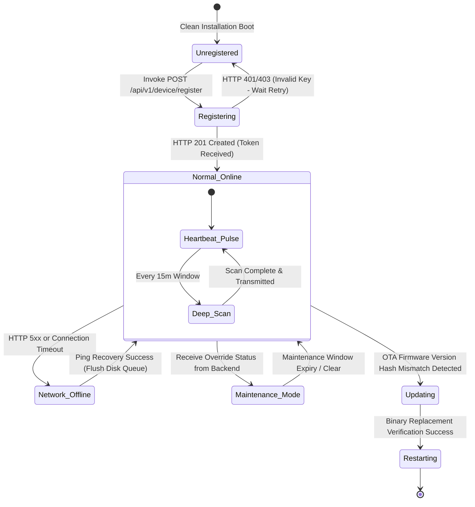

# NOS Complete Monitoring Agent Architecture v1.0

This specification details the end-to-end architectural engineering, lifecycle execution, and state management of the Neural Operating System (NOS) edge monitoring agent (`apps/agent`). Adhering strictly to **Global Rule 7** ("Agent never knows database"), **Global Rule 8** ("Dashboard never communicates with agent"), and **Global Rule 9** ("Nothing uses fake data"), this .NET C# daemon executes purely as an autonomous sensor communicating via authenticated HTTP APIs.

---

## 1. Agent Structural Design & Dependency Injection Model

The agent leverages .NET Core hosting worker architectures, binding cross-platform diagnostic collectors via dependency injection without direct hardware coupling (Verified in Module 0 / RCA-6):

```
apps/agent/
├── Config/
│   └── AgentConfig.cs            [Type-safe appsettings & Environment Binder]
├── Services/
│   ├── IMetricCollector.cs         [Platform-Agnostic Diagnostic Interface Contract]
│   ├── WindowsMetricCollector.cs   [Windows Performance Counters Implementation]
│   ├── LinuxMetricCollector.cs     [Linux /proc & sysfs Parsing Implementation]
│   ├── SimulationMetricCollector.cs[Deterministic Test Profile Implementation]
│   ├── OfflineBufferService.cs     [Encrypted Disk FIFO Queue Engine]
│   └── SystemDiagnosticsService.cs [Telemetry Coordinator & Lifecycle Orchestrator]
└── Program.cs                      [Host Builder, DI Registration & Worker Bootstrapper]
```

---

## 2. Definitive Agent Operational Lifecycle Specification

### 1. Installer & Provisioning Engine

- **Silent Deployment**: Configured via command-line arguments during MSI or Linux `.deb`/`.rpm` automated MDM provisioning (`msiexec /i NOSAgent.msi REG_KEY="NOS-XXX" SERVER_URL="https://api.nos.internal"`).
- **Service Registration**: Auto-registers as a background Windows Service (`NOSMonitoringService`) or systemd background daemon (`nos-agent.service`) configured with automatic recovery restart policies.

### 2. Registration & Authentication Handshake

- Upon initial clean boot, the agent executes an HTTPS POST request to `/api/v1/device/register` supplying its hardware fingerprint, OS version, and initial `X-Registration-Key`.
- **Token Security**: Upon receiving an HTTP 201 response, the agent stores the returned unique `deviceId`, hardware `uuid`, and opaque cryptographic `token` in local secure storage (Windows Data Protection API / DPAPI or Linux SecretService / file permissions `0600`). Subsequent calls present `Authorization: Bearer <token>`.

### 3. Scheduler & Concurrent Execution Workers

The agent orchestrates two distinct asynchronous polling timers:

1. **Heartbeat & Liveness Worker**: Fires strictly every **10 seconds** (`AgentConfig__PollIntervalSeconds`). Transmits light CPU/RAM/Uptime status pulses (`POST /api/v1/device/heartbeat`) to inform real-time offline detection monitors.
2. **Deep Inventory & Telemetry Worker**: Fires every **15 minutes** (or upon explicit server state override). Performs comprehensive hardware component inventory discovery and asset fingerprint calculation (`POST /api/v1/inventory/snapshot`).

### 4. Collectors & Zero-Guess Abstraction (`IMetricCollector`)

In accordance with Rule 1 & 2 ("Nothing can be fake", "No static fallbacks"), raw metric sampling delegates via DI singleton registration in `Program.cs`:

- **Windows Runtime (`WindowsMetricCollector`)**: Queries `System.Diagnostics.PerformanceCounter` for `% Processor Time` and `Available MBytes`.
- **Linux Runtime (`LinuxMetricCollector`)**: Reads `/proc/stat` to calculate jiffies usage percentages and parses `/proc/meminfo` for active RAM utilization.
- **CI Simulation Profile (`SimulationMetricCollector`)**: When activated via `NOS_AGENT_SIMULATION_MODE=true`, emits deterministic mathematical curves free of `Random()` noise, guaranteeing reliable operational acceptance test verification.

### 5. Serializer, Compression, & Offline Buffer Queue

- **Serialization & Compression**: Gathered telemetry snapshots are serialized into verified `@nos/shared-types` JSON payloads and compressed via Gzip stream encoders if exceeding 1 KB.
- **Offline Resiliency (`OfflineBufferService`)**: If backend ingestion gateways experience network timeouts or return 5xx errors, payloads drop into an encrypted local SQLite/JSON FIFO queue on disk (capped at 50 MB to prevent local target disk exhaustion).
- **Retry & Recovery Strategy**: While offline, the agent initiates exponential backoff reconnect testing (intervals scaling: 5s -> 15s -> 30s -> 60s max). Upon network recovery, queued snapshots flush sequentially before resuming normal polling schedules.

---

## 3. Comprehensive Agent State Machine

The daemon manages operational states via an immutable finite-state machine (FSM):



### State Definitions & Behavior:

- **Unregistered**: Initial installation state. Polling engines remain inactive until enrollment handshake completes successfully.
- **Normal_Online**: Core operating state. Heartbeat timers fire every 10 seconds; deep hardware scans fire every 15 minutes.
- **Network_Offline**: Triggered by TCP/TLS transport disconnection or continuous 5xx server exceptions. Live metric collection persists to local encrypted disk storage while exponential backoff probes gateway liveness.
- **Maintenance_Mode**: Triggered when a heartbeat response instructs the agent that an active `MaintenanceWindow` exists in the backend. High-frequency telemetry submission tempers down to conserve network resources while preserving basic heartbeat check-ins.
- **Updating**: Triggered when an ingested backend instruction signals an Over-The-Air (OTA) version upgrade. The agent downloads the signed binary payload, verifies SHA-256 cryptographic signatures, sets up staging replacements, and triggers an automated service restarting cycle.
