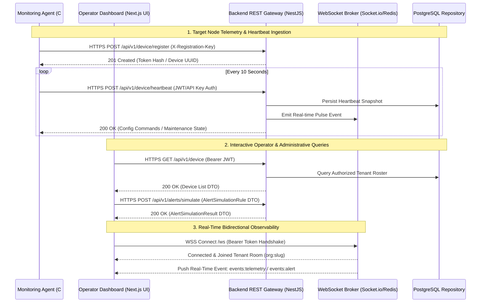

# NOS API Contracts & Communication Architecture v1.0

This specification formalizes every application communication channel, transport protocol, and RESTful API contract within the Neural Operating System (NOS). In strict compliance with **Global Rule 4** ("Every API must have one documented owner") and **Global Rule 8** ("Dashboard never communicates with agent"), all client mutations and ingestion payloads converge exclusively on documented backend gateway routes.

---

## 1. System Communication Protocols & Transport Architecture

The repository enforces four dedicated communication topologies, isolating presentation clients from raw hardware endpoint execution:



---

### Transport Protocol Evaluation Matrix

| Protocol                      | Circuit Target & Direction                                 | Why Chosen (Engineering Rationale)                                                                                                 | Advantages                                                                                               | Limitations & Failure Mitigation                                                                                                                             | Authentication & Retry Strategy                                                                                                  |
| :---------------------------- | :--------------------------------------------------------- | :--------------------------------------------------------------------------------------------------------------------------------- | :------------------------------------------------------------------------------------------------------- | :----------------------------------------------------------------------------------------------------------------------------------------------------------- | :------------------------------------------------------------------------------------------------------------------------------- |
| **HTTPS REST (TLS 1.3)**      | Frontend -> Backend<br>Agent -> Backend                    | Ubiquitous firewall passage, strict request-response statelessness, cacheability, and idempotent schema enforcement via DTOs.      | Native firewall compatibility, load balancer friendliness, standard HTTP status codes.                   | Higher protocol per-request header overhead.<br>**Mitigation**: Connection pooling, Gzip compression, edge CDN distribution.                                 | Bearer JWT / Pre-shared Registration Key.<br>**Retry**: Exponential backoff with random jitter (2s -> 4s -> 8s, max 5 attempts). |
| **WebSocket (WSS)**           | Backend <-> Frontend<br>Backend <-> Agent                  | True duplex asynchronous push messaging required for sub-second alert broadcasting and instantaneous node offline status alerting. | Eliminates long-polling HTTP latency; persistent TCP connection; minimal frame overhead.                 | TCP socket disconnects across firewalls; stateful server connections.<br>**Mitigation**: Automatic reconnection loops with ping/pong heartbeats (every 25s). | JWT evaluated during connection upgrade handshake.<br>**Retry**: Reconnect loop with capped exponential delay (1s to 30s max).   |
| **Outbound Webhooks (HTTPS)** | Backend -> External Tenant Collectors (Slack/Discord/REST) | Asynchronous webhook delivery for third-party enterprise integrations and SIEM alert forwarding.                                   | Vendor-neutral enterprise data export; fully decoupling core notification processing from external SLAs. | Target recipient endpoint downtime or slow response latency.<br>**Mitigation**: Dead-Letter Queue (DLQ) tracking via `NotificationLog`.                      | HMAC-SHA256 payload signing header (`X-NOS-Signature`).<br>**Retry**: Asynchronous BullMQ background job retries (up to 7 days). |

---

## 2. Definitive API Endpoint Ownership & Contract Specifications

Every endpoint exposed by `apps/backend` is strictly owned by one domain module. No alternate module may alter the input/output schemas or hijack the route namespace. All DTO interfaces reference synchronized `@nos/shared-types` definitions.

### Device Registry & Ingestion Contracts (Owner: `device`)

#### 1. Device Registration (`POST /api/v1/device/register`)

- **Purpose**: Authenticates a newly installed edge agent using a pre-shared cryptographic key and enrolls the node into the organization roster.
- **Authentication & Headers**: `X-Registration-Key` header or payload parameter verified against active `RegistrationKey` hashes in the database.
- **Input DTO (`RegisterDeviceDto`)**:
  ```typescript
  interface RegisterDeviceDto {
    hostname: string;
    deviceName: string;
    os: string;
    osVersion: string;
    architecture: string;
    agentVersion: string;
    macAddress?: string;
    organizationId?: string; // Optional test-profile override per Checkpoint 12 verification
  }
  ```
- **Validation Rules**: `hostname` and `deviceName` must be non-empty alphanumeric strings; `agentVersion` must match semver syntax.
- **Output DTO (HTTP 201 Created)**:
  ```typescript
  interface RegisterDeviceResponse {
    success: boolean;
    deviceId: string; // Unique database UUID
    uuid: string; // Assigned node hardware fingerprint UUID
    token: string; // Opaque cryptographic device API token for heartbeat ingestion
    pollIntervalSeconds: number; // Committer interval instruction (default: 10s)
  }
  ```
- **Error Responses**: `400 Bad Request` (Invalid DTO schema); `401 Unauthorized` (Invalid or expired Registration Key); `403 Forbidden` (Organization Quota Exceeded).
- **Idempotency & Rate Limit**: Idempotent by `hostname` + `organizationId` pair (re-enrolls existing target node). Limit: 5 requests per minute per IP.

#### 2. Agent Heartbeat & Telemetry Pulse (`POST /api/v1/device/heartbeat`)

- **Purpose**: Ingests periodic liveness heartbeats and primary resource KPIs from active desktop daemon workers.
- **Authentication**: `Authorization: Bearer <device-opaque-token>` validated against `devices.tokenHash`.
- **Input DTO (`HeartbeatDto`)**:
  ```typescript
  interface HeartbeatDto {
    deviceId: string;
    cpuUsage: number; // 0.00 to 100.00 percentage
    ramUsage: number; // 0.00 to 100.00 percentage
    uptime: number; // System uptime in fractional seconds
    ipAddress: string; // Valid IPv4/IPv6 address
  }
  ```
- **Output DTO (HTTP 200 OK)**:
  ```typescript
  interface HeartbeatResponse {
    success: boolean;
    status: "ONLINE" | "MAINTENANCE" | "DEGRADED";
    timestamp: string; // ISO-8601 server validation time
  }
  ```
- **Error Responses**: `400 Bad Request` (Out of bounds percentages); `401 Unauthorized` (Token revoked or device decommissioned).
- **Rate Limit**: Strictly limited to 1 pulse per 5 seconds per device UUID.

---

### Alerting & Rule Simulation Contracts (Owner: `alerts`)

#### 3. Rule Simulation Engine (`POST /api/v1/alerts/simulate`)

- **Purpose**: Executes real-time simulation of proposed alert thresholds against historical telemetry snapshots without persisting false production incidents (Verified in Module 0 / RCA-2).
- **Authentication**: Operator JWT via `Authorization: Bearer <jwt-token>` with `alerts:simulate` RBAC scope.
- **Input DTO (`AlertSimulationRule`)**:
  ```typescript
  interface AlertSimulationRule {
    metric: string; // e.g., "cpuUsage", "ramUsage", "diskUsagePercent"
    operator: ">" | ">=" | "<" | "<=" | "==" | "!=";
    threshold: number; // Numeric trigger barrier
    durationSeconds: number; // Duration threshold before alerting
    deviceId?: string; // Optional specific device focus
  }
  ```
- **Output DTO (HTTP 200 OK - `AlertSimulationResult`)**:
  ```typescript
  interface AlertSimulationResult {
    rule: AlertSimulationRule;
    evaluatedCount: number; // Total historical data points analyzed
    triggeredCount: number; // Number of simulated alert fire occurrences
    triggers: Array<{
      deviceId: string;
      hostname?: string;
      timestamp: string | Date;
      metricValue: number;
    }>;
  }
  ```
- **Error Responses**: `400 Bad Request` (Unsupported operator or invalid metric name); `401 Unauthorized` (Missing or invalid operator JWT).
- **Idempotency & Rate Limit**: Completely read-only and idempotent. Limit: 30 simulations per minute per user.

#### 4. List Active Incidents (`GET /api/v1/alerts`)

- **Purpose**: Retrieves paginated, tenant-isolated alert incidents for operator dashboard review.
- **Authentication**: Operator JWT (`Authorization: Bearer <jwt-token>`).
- **Query Parameters**: `status` (NEW, OPEN, ACKNOWLEDGED, RESOLVED); `severity` (CRITICAL, HIGH, MEDIUM, LOW, INFO); `page` (number); `limit` (max 100).
- **Output DTO (HTTP 200 OK)**:
  ```typescript
  interface PaginatedAlertsResponse {
    data: Array<{
      id: string;
      incidentNumber: string;
      title: string;
      description: string;
      severity: string;
      status: string;
      deviceId: string;
      firstOccurred: string;
      lastOccurred: string;
      occurrenceCount: number;
    }>;
    meta: { total: number; page: number; limit: number; totalPages: number };
  }
  ```
- **Error Responses**: `401 Unauthorized`. Rate Limit: 100 requests per minute per user.

---

### Asset Inventory Discovery Contracts (Owner: `inventory`)

#### 5. Ingest Complete Asset Breakdown (`POST /api/v1/inventory/snapshot`)

- **Purpose**: Ingests deeply parsed hardware specifications, installed software enumerations, and security postures scanned by desktop agents.
- **Authentication**: `Authorization: Bearer <device-token>`.
- **Input DTO (`DeviceInventorySnapshotDto`)**:
  ```typescript
  interface DeviceInventorySnapshotDto {
    deviceId: string;
    manufacturer: string;
    model: string;
    serialNumber: string;
    motherboard: string;
    biosVendor: string;
    biosVersion: string;
    cpuModel: string;
    physicalCores: number;
    logicalCores: number;
    memoryModules: Array<{
      slot: string;
      capacityBytes: number;
      speedMHz: number;
      manufacturer: string;
    }>;
    diskDrives: Array<{
      driveName: string;
      model: string;
      sizeBytes: number;
      fileSystem: string;
    }>;
    networkAdapters: Array<{
      name: string;
      macAddress: string;
      ipv4: string;
      speedMbps: number;
    }>;
    installedSoftware: Array<{
      name: string;
      publisher: string;
      version: string;
      installDate: string;
    }>;
    security: {
      windowsDefenderEnabled: boolean;
      firewallEnabled: boolean;
      bitLockerEnabled: boolean;
      tpmEnabled: boolean;
    };
    eventLogs?: Record<string, any>; // Flexible OS log JSON blob
  }
  ```
- **Output DTO (HTTP 200 OK)**:
  ```typescript
  interface InventorySnapshotResponse {
    success: boolean;
    inventoryId: string;
    assetFingerprint: string; // SHA256 cryptographic hash of composite hardware state
    diffDetected: boolean; // True if hardware components mutated since last scan
  }
  ```
- **Error Responses**: `400 Bad Request` (Malformed JSON or missing required arrays); `401 Unauthorized`.
- **Idempotency**: Fully idempotent; if `assetFingerprint` equals existing hash, database updates are bypassed to conserve I/O. Limit: 1 scan per 15 minutes per device.

---

### Core Authentication Contracts (Owner: `auth`)

#### 6. Operator Login (`POST /api/v1/auth/login`)

- **Purpose**: Authenticates operator credentials and initiates an active secure session.
- **Authentication**: Public endpoint.
- **Input DTO**: `email` (string), `password` (string), `otpCode` (optional string for 2FA).
- **Output DTO (HTTP 200 OK)**:
  ```typescript
  interface LoginResponse {
    accessToken: string; // Short-lived JWT (15-minute expiration)
    refreshToken: string; // Opaque long-lived session token (7-day expiration)
    user: {
      id: string;
      email: string;
      role: string;
      firstName: string;
      lastName: string;
      organizationId: string;
    };
  }
  ```
- **Error Responses**: `400 Bad Request`; `401 Unauthorized` (Invalid email/password combination); `429 Too Many Requests` (Account locked after 5 consecutive failed attempts). Rate Limit: 5 failed attempts per 15 minutes per IP.

---

## 3. Versioning & Deprecation Lifecycle Policy

1. **URL Namespace Inheritance**: All exposed HTTP endpoints reside strictly under `/api/v1/<domain>/*`. Non-prefixed routing is strictly forbidden.
2. **Backwards Compatible Evolution**: Adding optional properties to Input DTOs or appending fields to Output JSON responses constitutes a compatible non-breaking change within `/v1/`.
3. **Breaking Change Induction**: Rename or deletion of existing DTO parameters forces the deployment of a new major URL schema (`/api/v2/<domain>/*`). The older v1 route handler must operate in deprecated maintenance mode for a mandatory 90-day sunset notification period before excision.
