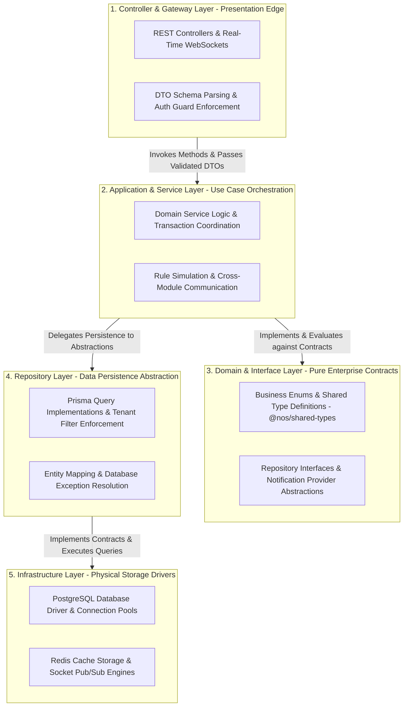

# NOS Backend Layered Clean Architecture & Testing Strategy v1.0

This document governs the structural implementation, dependency boundaries, design patterns, and mandatory testing methodologies for the core backend application (`apps/backend`), adhering strictly to **Global Rule 1** ("Never generate code before defining architecture") and **Global Rule 2** ("Every folder must have exactly one responsibility").

---

## 1. Five-Tier Layered Clean Architecture

To guarantee high maintainability, testability, and strict decoupling of business domain truth from underlying physical infrastructure, every domain module in `apps/backend/src/modules/<module>/` must structure its code across five immutable horizontal layers:

---

### Layer Responsibility & Dependency Rules

| Architectural Layer | Core Responsibility | Permitted Upstream Dependencies | Forbidden Dependencies (Constitutional Ban) |
| :--- | :--- | :--- | :--- |
| **1. Controller Layer** | Handles raw HTTP/WebSocket protocol requests, parses incoming payloads against `@nos/shared-types` DTOs, executes NestJS authentication guards, and formats HTTP responses. | Application Services (`Layer 2`), DTO Contracts (`Layer 3`), Common Guards/Filters. | Repositories (`Layer 4`), Direct Database Drivers (`Layer 5`), other domain Controller files. |
| **2. Application Layer**| Contains pure business application use case logic, orchestrates transactional multi-step workflows (e.g., Device Registration, Alert Incident Triggering), and emits system events. | Domain Interfaces (`Layer 3`), Injected Repositories (`Layer 4`), exported Services of shared peer modules. | HTTP Request/Response objects, Express/Socket handles, raw database vendor syntax strings. |
| **3. Domain Layer** | Holds core domain entity structures, business rule constants, validation enums, and abstract TypeScript interfaces (`IAlertRepository`, `INotificationProvider`). | Zero dependencies (Self-contained pure domain logic and `@nos/shared-types`). | Any external library, framework annotation (NestJS/Prisma), or application implementation file. |
| **4. Repository Layer**| Implements persistence contracts defined in Layer 3. Translates domain request parameters into Prisma ORM query builder statements while forcing mandatory tenant ID filtering. | Domain Interfaces (`Layer 3`), Infrastructure Drivers (`Layer 5`, e.g., `PrismaService`). | Application Services (`Layer 2`), HTTP Controller objects (`Layer 1`). |
| **5. Infrastructure**| Manages raw wire connections to external persistence hardware, database pooling, Redis sockets, and vendor SDKs. | Low-level database drivers, Node environment OS socket libraries. | Any application, domain, or controller logic. |

---

## 2. Rigorous Backend Testing Strategy & Verification Harness

In accordance with our verified operational acceptance stability (31/31 passing unit and integration checkpoints in Module 0), backend modification is governed by strict testing methodologies.

### 1. Unit Testing Strategy
- **Scope & Isolation**: Unit tests target Layer 2 Application Services (`*.service.spec.ts`) and custom algorithmic utility calculators (`RuleSimulationService`).
- **Mocking Standard**: All persistence dependencies (`PrismaService`, external notification webhooks, Redis drivers) MUST be injected as deterministic mock providers using `Test.createTestingModule()`.
- **Zero Real Database Connection**: Unit tests must execute in complete offline memory isolation without opening real TCP socket connections to PostgreSQL or Redis.

### 2. Operational Acceptance & Integration Testing Strategy
- **Scope**: Integration verification (`operational-acceptance.spec.ts`) evaluates the complete collaborative execution of inter-dependent backend modules across standard SaaS business workflows (Device Enrollment -> Telemetry Ingestion -> Alert Evaluation -> Notification Delivery -> Audit Logging).
- **Schema & DTO Consistency**: Testing harnesses must import exact production `@nos/shared-types` definitions. Where multi-tenant test orchestration requires administrative overrides (e.g., injecting an explicit `organizationId` during bulk onboarding), the interface contract must formalize the property cleanly without undocumented type casting hacks (Verified in Module 0 / RCA-5).

---

## 3. Cross-Cutting Concern Enforcement (Validation & Caching)

### 1. Mandatory Input DTO Validation
Every API endpoint handler in Layer 1 must apply NestJS automatic Validation Pipes configured with strict defensive properties:
- `whitelist: true`: Automatically strips and discards any unapproved client JSON fields missing from explicit DTO class declarations.
- `forbidNonWhitelisted: true`: Immediately rejects payloads containing undocumented or spoofed data properties with an HTTP `400 Bad Request`.
- `transform: true`: Automatically converts parsed JSON wire types into verified TypeScript primitive types (numbers, booleans, Date instances) before passing control to Layer 2 Application Services.

### 2. Strategic Read-Only Caching
To optimize read-heavy dashboard execution and reduce PostgreSQL database connection contention:
- **Redis Target Profiles**: High-frequency read-only endpoints (e.g., active node counts, hourly telemetry aggregates in `dashboard`, compiled smart group device UUID lists in `fleet`) utilize Redis caching wrappers with time-to-live (TTL) bounds ranging between **15 and 300 seconds**.
- **Cache Invalidation & Consistency**: Any state-changing mutation in Layer 2 Application Services (such as device deletion or rule disablement) emits an immediate asynchronous Redis key eviction command (`cacheManager.del`), guaranteeing that subsequent dashboard queries never render stale operational snapshots.
