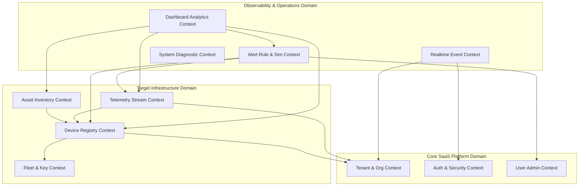

# NOS Bounded Contexts, Domain Model & Dependency Graph v1.0

This specification formalizes the enterprise domain model of the Neural Operating System (NOS), establishing unambiguous boundaries, explicit domain ownership, and an immutable Directed Acyclic Graph (DAG) governing all inter-module dependencies in strict adherence to **Global Rule 3** ("No circular dependencies") and **Global Rule 4** ("Every API must have one documented owner").

---

## 1. Bounded Context Identification & Responsibility Catalog

The system is compartmentalized into **11 Core Bounded Contexts**, mirrored directly in `apps/backend/src/modules/` and `apps/frontend/src/features/`.



---

### Domain Detailed Specifications

#### 1. Tenant & Organization Domain (`tenant`)
*   **Purpose**: Multi-tenant SaaS isolation, custom branding, domain governance, and quota management.
*   **Responsibilities**: Managing organization profiles, member enrollment, department/team hierarchies, invitation lifecycles, and storage/device resource quotas.
*   **What Belongs Inside**: `Organization`, `Department`, `Team`, `OrganizationMember`, `OrganizationInvitation`, `OrganizationQuota`, `OrganizationWebhook`, and audit logs.
*   **What Must Never Belong Inside**: Device hardware metrics, individual telemetry snapshots, alert threshold calculations, or agent binary configurations.
*   **Dependencies**: None (Foundation Layer).
*   **Public API & Ownership**: Owner of `/api/v1/organizations/*`, `/api/v1/invitations/*`, `/api/v1/webhooks/*`.
*   **Database Ownership**: `organizations`, `departments`, `teams`, `organization_members`, `organization_invitations`, `organization_quotas`, `organization_webhooks`.
*   **Future Scalability**: Horizontal sharding by `organizationId`; per-tenant isolation encryption keys (BYOK).

#### 2. Authentication & Session Domain (`auth`)
*   **Purpose**: Cryptographic identity verification, JWT issuing, session risk analysis, and role-based access control (RBAC).
*   **Responsibilities**: Validating credentials, issuing refresh/access tokens, enforcing 2FA/OTP workflows, monitoring session risk, and revoking compromised tokens.
*   **What Belongs Inside**: JWT strategies, password hashing, session tracking, OTP generation, and token revocation tables.
*   **What Must Never Belong Inside**: Business logic for alerting, device health calculations, or hardware inventory auditing.
*   **Dependencies**: `users`, `tenant`.
*   **Public API & Ownership**: Owner of `/api/v1/auth/*`, `/api/v1/sessions/*`.
*   **Database Ownership**: `refresh_tokens`, `verification_otps`, `user_sessions`, `api_keys`, `permission_profiles`, `role_templates`.
*   **Future Scalability**: Distributed Redis session caching; OAuth2/SAML SSO enterprise identity provider integrations.

#### 3. User Administration Domain (`users`)
*   **Purpose**: Operator identity profiles, activity logging, and inter-team assignments.
*   **Responsibilities**: Managing user personal details, role assignments, alert handler attributions, and user audit histories.
*   **What Belongs Inside**: User account metadata, activity tracking, and assignment histories.
*   **What Must Never Belong Inside**: Raw JWT secrets, cryptographic registration keys, or device hardware telemetry.
*   **Dependencies**: `tenant`.
*   **Public API & Ownership**: Owner of `/api/v1/users/*`.
*   **Database Ownership**: `users`, `user_activities`, `audit_logs`.
*   **Future Scalability**: Fine-grained Attribute-Based Access Control (ABAC) execution caching.

#### 4. Fleet & Registration Domain (`fleet`)
*   **Purpose**: Secure fleet enrollment, bulk node orchestration, and registration token authorization.
*   **Responsibilities**: Generating and hashing cryptographic registration keys, enforcing max-use limits, tracking device enrollment lineage, and organizing smart/static device groups.
*   **What Belongs Inside**: Registration key validation, group filtering criteria, and inter-organizational transfer requests.
*   **What Must Never Belong Inside**: Live hardware CPU/RAM streams, individual alert notification deliveries, or system UI components.
*   **Dependencies**: `tenant`, `users`.
*   **Public API & Ownership**: Owner of `/api/v1/fleet/*`, `/api/v1/registration-keys/*`, `/api/v1/device-groups/*`.
*   **Database Ownership**: `registration_keys`, `device_groups`, `smart_groups`, `device_ownerships`, `device_transfer_requests`.
*   **Future Scalability**: Automated zero-touch deployment via PXE/MDM bootstrapping; dynamic smart group compiled queries.

#### 5. Device Registry Domain (`device`)
*   **Purpose**: Single source of truth for managed infrastructure targets and lifecycle status.
*   **Responsibilities**: Tracking node hostnames, UUIDs, OS architecture, agent versions, online/offline transitions, maintenance windows, and operational timeline logs.
*   **What Belongs Inside**: Node registry state, device heartbeat persistence, status transitions, and timeline auditing.
*   **What Must Never Belong Inside**: User password resets, tenant quota calculations, or general application log sinks.
*   **Dependencies**: `tenant`, `fleet`.
*   **Public API & Ownership**: Owner of `/api/v1/device/*`, `/api/v1/nodes/*`, `/api/v1/heartbeat/*`.
*   **Database Ownership**: `system_nodes`, `devices`, `heartbeats`, `maintenance_windows`, `device_timeline_events`.
*   **Future Scalability**: Redis heartbeat state caching with distributed TTL event listeners for instantaneous offline detection.

#### 6. Asset Inventory Domain (`inventory`)
*   **Purpose**: Deep hardware, software, security, and networking configuration discovery.
*   **Responsibilities**: Ingesting component breakdown snapshots (BIOS, motherboards, RAM modules, GPUs, network interfaces, installed software, Windows services, BitLocker/TPM security status), auditing changes, and hashing asset fingerprints.
*   **What Belongs Inside**: Structured entity tables for hardware components and flexible JSON blobs for extensible platform diagnostic items (`eventLogs`, `smartData`).
*   **What Must Never Belong Inside**: High-frequency ephemeral performance telemetry (CPU utilization %, disk IOPS) or user login sessions.
*   **Dependencies**: `device`.
*   **Public API & Ownership**: Owner of `/api/v1/inventory/*`, `/api/v1/assets/*`.
*   **Database Ownership**: `device_inventories`, `memory_modules`, `disk_drives`, `gpus`, `network_adapters`, `installed_software`, `windows_services`, `startup_applications`, `security_inventories`, `device_capabilities`, `inventory_audit_logs`.
*   **Future Scalability**: Automated CVE vulnerability matching against installed software version matrices.

#### 7. Telemetry Ingestion Domain (`telemetry`)
*   **Purpose**: High-frequency time-series performance data ingestion, compression, and retention pruning.
*   **Responsibilities**: Collecting live CPU, RAM, disk, network throughput, temperature, and connection counts; pruning historical snapshots exceeding tenant retention policies.
*   **What Belongs Inside**: Time-series snapshot tables, bulk metric ingestion validators, and background retention cleanup jobs.
*   **What Must Never Belong Inside**: Static hardware serial numbers, user profile configurations, or alert notification dispatchers.
*   **Dependencies**: `device`, `tenant`.
*   **Public API & Ownership**: Owner of `/api/v1/telemetry/*`, `/api/v1/metrics/*`.
*   **Database Ownership**: `telemetry_snapshots`.
*   **Future Scalability**: Partitioning `telemetry_snapshots` by month/timestamp; migrating storage to TimescaleDB or ClickHouse engines for hyper-scale ingestion.

#### 8. Alert & Rule Engine Domain (`alerts`)
*   **Purpose**: Deterministic rule evaluation, threshold monitoring, simulation testing, and incident response orchestration.
*   **Responsibilities**: Evaluating live telemetry and heartbeat pulses against configured rules (`AlertRule`), executing syntax tree simulations (`POST /api/v1/alerts/simulate`), managing incident lifecycles (New -> Open -> Acknowledged -> Resolved), logging notifications, and tracking escalation histories.
*   **What Belongs Inside**: Threshold rules, active incident tracking, simulation execution models, operator comments, notification logs, and escalation histories.
*   **What Must Never Belong Inside**: Raw telemetry parsing, device OS installation procedures, or billing account settings.
*   **Dependencies**: `device`, `telemetry`, `users`.
*   **Public API & Ownership**: Owner of `/api/v1/alerts/*`, `/api/v1/rules/*`, `/api/v1/incidents/*`.
*   **Database Ownership**: `alerts`, `alert_rules`, `alert_rule_audit_logs`, `alert_history`, `alert_comments`, `notification_logs`, `alert_assignments`, `alert_escalations`.
*   **Future Scalability**: Distributed streaming event correlation engines; AI-driven dynamic threshold anomaly detection.

#### 9. Realtime Communication Domain (`realtime`)
*   **Purpose**: Bidirectional WebSocket event brokering between core backend services and connected operator UIs.
*   **Responsibilities**: Managing WebSocket client rooms by `organizationId`, pushing instant alert notifications, broadcasting online/offline status updates, and handling client authentication handshakes.
*   **What Belongs Inside**: Socket.io / WebSockets gateways, event emitter subscriber bridges, and room authentication guards.
*   **What Must Never Belong Inside**: Direct database SQL queries or independent business mutations (must act solely as an event broker for application services).
*   **Dependencies**: `auth`, `tenant`.
*   **Public API & Ownership**: Owner of WebSocket namespace `/ws` and event channels (`events:telemetry`, `events:alert`, `events:device_status`).
*   **Database Ownership**: None (Stateless / Redis Pub-Sub Backed).
*   **Future Scalability**: Redis Pub-Sub adapter clustering across horizontal NestJS gateway instances.

#### 10. Dashboard Analytics Domain (`dashboard`)
*   **Purpose**: High-level cross-domain KPI aggregation and fleet executive reporting.
*   **Responsibilities**: Compiling summary statistics (total devices, degraded nodes, active critical alerts, telemetry distribution histograms) into single-request view models for frontend efficiency.
*   **What Belongs Inside**: Read-only aggregation services and optimized cross-table statistical reporting queries.
*   **What Must Never Belong Inside**: Write-mode mutations, entity deletion handlers, or individual sensor registration logics.
*   **Dependencies**: `device`, `telemetry`, `alerts`, `inventory`, `tenant`.
*   **Public API & Ownership**: Owner of `/api/v1/dashboard/*`, `/api/v1/analytics/*`, `/api/v1/reports/*`.
*   **Database Ownership**: None (Read-only consumer of authorized domain repositories).
*   **Future Scalability**: Pre-computed hourly summary materialized views in PostgreSQL for sub-10ms executive reporting.

#### 11. Health & Diagnostics Domain (`health`)
*   **Purpose**: Internal liveness, readiness, and subsystem operational integrity verification.
*   **Responsibilities**: Verifying PostgreSQL connectivity, Redis latency, memory footprint, and disk availability for container orchestration probes.
*   **What Belongs Inside**: Health Check endpoints, dependency probes, and readiness report generators.
*   **What Must Never Belong Inside**: Tenant business metrics or infrastructure target telemetry.
*   **Dependencies**: Core infrastructure connectors (Prisma, Redis).
*   **Public API & Ownership**: Owner of `/api/v1/health/*`, `/metrics` (Prometheus export).
*   **Database Ownership**: None.
*   **Future Scalability**: Deep dependency health simulation probing with circuit-breaker threshold alarms.

---

## 2. Comprehensive Dependency Graph (Directed Acyclic Graph)

To enforce **Global Rule 3**, no circular dependencies are permitted at any layer. The system dependency graph flows strictly downward through established abstraction layers:

```
[Level 4: Presentation & Edge Agents]
      │
      ├───> apps/frontend (Next.js UI) ─────┐
      └───> apps/agent (C# Daemon) ──────────┼───> [HTTP REST / WebSocket Protocols]
                                             │
[Level 3: Aggregation & Gateway Layer]       │
      │                                      ▼
      ├───────> Dashboard Module <─── NestJS API Controllers & Realtime Gateway
      └───────> Realtime Module
                     │
                     ▼
[Level 2: Business & Processing Layer]
      │
      ├───────> Alerts & Rule Simulation Module
      ├───────> Telemetry Ingestion Module
      ├───────> Asset Inventory Module
      └───────> Device Registry Module
                     │
                     ▼
[Level 1: Core Identity & Organization Layer]
      │
      ├───────> Fleet & Registration Module
      ├───────> Authentication & Session Module
      ├───────> User Administration Module
      └───────> Tenant & Organization Module
                     │
                     ▼
[Level 0: Persistence & Shared Infrastructure Layer]
      │
      ├───────> @nos/shared-types Package (DTOs & Enums)
      ├───────> Prisma Repository Layer (PostgreSQL)
      └───> Redis Cache & Pub/Sub Engine
```

### Immutable Dependency Enforcement Rules:
1. **Level 4 (Clients)** depend exclusively on API endpoints exposed by Level 3 and Level 2. They possess zero knowledge of Level 0 storage architectures.
2. **Level 3 (Aggregation)** may query services from Level 2 and Level 1 in read-only mode to assemble complex dashboards and real-time broadcasts. Level 2 modules must never import or reference Level 3 aggregation modules.
3. **Level 2 (Business Processing)** coordinates telemetry, inventory, and alerting logic. They depend on Level 1 to authenticate requests and identify tenant context.
4. **Level 1 (Core Identity)** forms the foundation of SaaS multi-tenancy and authentication. It depends exclusively on Level 0 shared types and database repositories.
5. **Level 0 (Persistence)** is completely agnostic of upper application logic. `packages/shared-types` imports zero code from any application.
