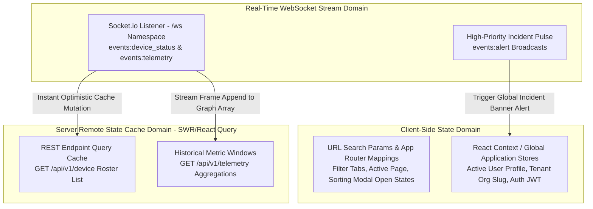

# NOS Frontend Architecture & State Management Standards v1.0

This document governs the modular presentation layer architecture, component composition rules, state management paradigms, and design aesthetics of the Neural Operating System (NOS) web application (`apps/frontend`). Designed around Next.js App Router technologies and strictly enforcing **Global Rule 6** ("Frontend never accesses database directly"), **Global Rule 8** ("Dashboard never communicates with agent"), and **Global Rule 9** ("Nothing uses fake data").

---

## 1. Modular Presentation Layout & Folder Structure

To preserve strict separation of presentation logic from domain state management, `apps/frontend/src/` enforces a clean feature-driven separation structure:

```
apps/frontend/src/
├── app/                        [Next.js App Router Navigation Layer]
│   ├── (auth)/login/page.tsx   [Unauthenticated Public Gateway Screens]
│   ├── (dashboard)/            [Authenticated Protected Dashboards]
│   │   ├── dashboard/page.tsx  [Fleet Executive KPI Telemetry UI]
│   │   ├── nodes/page.tsx      [Infrastructure Node Roster & Inventory UI]
│   │   ├── rules/page.tsx      [Alert Rule Studio & Simulator UI]
│   │   ├── alerts/page.tsx     [Active Incident Investigation & Resolution UI]
│   │   └── settings/page.tsx   [Tenant Administration & Security Policies UI]
│   └── layout.tsx              [Root Application Theme & Context Provider Wrapper]
├── components/                 [Universal Reusable Presentation UI Tokens]
│   ├── layout/Sidebar.tsx      [Verified Navigation Menu System (Zero 404s)]
│   ├── ui/Card.tsx             [Glassmorphic Container Tokens]
│   └── charts/TelemetryChart.tsx [Recharts / Canvas Performance Rendering Helpers]
├── features/                   [Self-Contained Functional Business View Modules]
│   ├── alerts/                 [Rule Simulator Forms, Incident Actions & State Hooks]
│   ├── dashboard/              [Summary Analytics View Models & Chart Data Parsers]
│   ├── device/                 [Device Table Renderers, Status Badge Logic & Detail Modals]
│   └── realtime/               [WebSocket Client Connection Bridge & Pulse Listeners]
├── lib/                        [Application Infrastructure Clients & Utilities]
│   ├── api-client.ts           [Axios / Fetch REST HTTP Wrapper with Auth Bearer Bindings]
│   └── ws-client.ts            [Socket.io Dedicated Tenant Connection Manager]
└── types/                      [Frontend View Assertions (Inheriting @nos/shared-types)]
```

---

## 2. State Management Architecture & Real-Time Integration

The frontend architecture bifurcates state management into three dedicated operational domains, eliminating overlapping state redundancy and DOM synchronization anomalies:



### State Enforcement Rules:

1. **Server Remote Cache (REST via HTTP Client)**: All baseline infrastructure roster records, inventory details, and paginated incident histories are fetched via centralized REST client utilities (`lib/api-client.ts`) utilizing asynchronous caching hooks (SWR or TanStack React Query). Direct manual `fetch()` declarations scattered inside UI components are forbidden.
2. **Real-Time WebSocket Ingestion**: Active dashboards connect exclusively via `lib/ws-client.ts` to `apps/backend/ws`. Upon receiving an event pulse (`events:device_status` or `events:alert`), the real-time hook performs an optimistic localized cache mutation on the underlying React Query state store, instantly reflecting node status color changes or new critical incident notifications in the DOM without initiating redundant HTTP long-polling loops.

---

## 3. UI Design Aesthetics & Performance Rules

To fulfill enterprise requirements for visual excellence, modern dynamic interactions, and high-performance rendering:

### 1. Premium Visual Identity & Typography

- **Tailored Color Palette**: Uses sleek, dark-mode focused HSL color space tokens with harmonious accent gradients (Vibrant Electric Blue `#0066FF`, Alert Neon Green `#00FF66`, Degraded Amber `#FFB000`, Critical Crimson `#FF3333`). Generic simple primary RGB colors are rejected.
- **Glassmorphism & Surface Tokens**: Container components (`ui/Card.tsx`) implement subtle background translucent blurs (`backdrop-filter: blur(12px)` with rgba border highlights) to impart a state-of-the-art enterprise software feel.
- **Modern Typography**: Renders cleanly via Google Fonts (`Inter` or `Outfit` var font stacks) with hierarchical line heights and legible numeric tabular spacing for fast operator analytical scanning.

### 2. Micro-Animations & Dynamic Feedback

- Interactive interface elements (sidebar items, table rows, button activations, threshold simulation toggles) embed smooth CSS transitions (`transition: all 0.2s ease-in-out`) and subtle hover transformations to ensure the dashboard feels responsive and actively engaged.

### 3. High-Frequency Chart Optimization

- Real-time CPU and Memory charting components (`charts/TelemetryChart.tsx`) must cap visible graph streaming arrays to a maximum of **60 concurrent historical points** (representing 10 minutes of heartbeat pulses at 10-second intervals).
- High-frequency canvas re-render cycles utilize memoized React wrappers (`React.memo`) and canvas-based or optimized SVG engines (such as Recharts) to prevent main-thread UI lag or CPU frame drop during concurrent multi-device monitoring broadcasts.

---

## 4. Strictly Forbidden Frontend Design Patterns (Anti-Patterns)

The following UI patterns constitute build-blocking architectural violations:

| Forbidden Anti-Pattern        | Constitutional Rule Violated                                                             | Why It Is Banished (Engineering Rationale)                                                                                                                                     | Enforced Alternative Solution                                                                                                                                      |
| :---------------------------- | :--------------------------------------------------------------------------------------- | :----------------------------------------------------------------------------------------------------------------------------------------------------------------------------- | :----------------------------------------------------------------------------------------------------------------------------------------------------------------- |
| **Direct DB SQL Execution**   | **Global Rule 6** ("Frontend never accesses database directly")                          | Exposes database configuration credentials to client browser bundles and bypasses backend multi-tenant RBAC guards.                                                            | All data queries terminate strictly at documented REST endpoints or WebSocket namespaces in `apps/backend`.                                                        |
| **Direct Agent Ping/Connect** | **Global Rule 8** ("Dashboard never communicates with agent")                            | Browser clients cannot bridge enterprise firewalls to ping edge workstations; introduces cross-origin security faults and unmonitored commands.                                | All node status assessments read from centralized database heartbeat persistence or backend WebSocket event streams.                                               |
| **Synthetic Data & Mocks**    | **Global Rule 9** ("Nothing uses fake data")                                             | Hardcoded metrics (`CPU: 34%`), random number generation (`Math.random() * 100`), or fake fallback UI skeletons deceive operators during production diagnostic investigations. | Render empty states, explicit loading indicators, or authentic error toasts when backend metrics are unavailable or uninitialized.                                 |
| **Placeholder & Dead Routes** | **Rule 3 & 4** (Module 0 Mandate: "No 404 pages", "No placeholder construction screens") | Erodes user confidence and litters codebase with incomplete, unmaintained UI fragments.                                                                                        | If a feature module is not fully backed by existing database schema and application API controllers, its navigation button must remain removed from `Sidebar.tsx`. |
| **Cross-Feature Import Leak** | **Global Rule 2** ("Every folder has exactly one responsibility")                        | Importing internal state logic from `features/alerts` directly into `features/device` creates tight circular coupling and breaks test isolation.                               | Shared logic migrates to `components/`, `lib/`, or unified Typescript interfaces in `packages/shared-types/`.                                                      |
