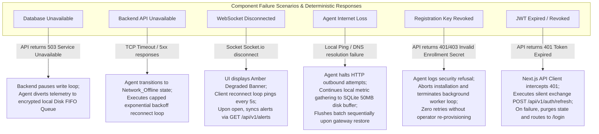
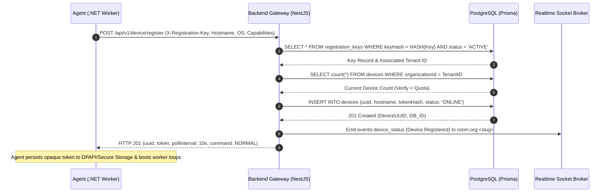
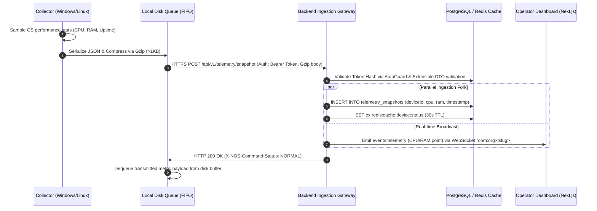
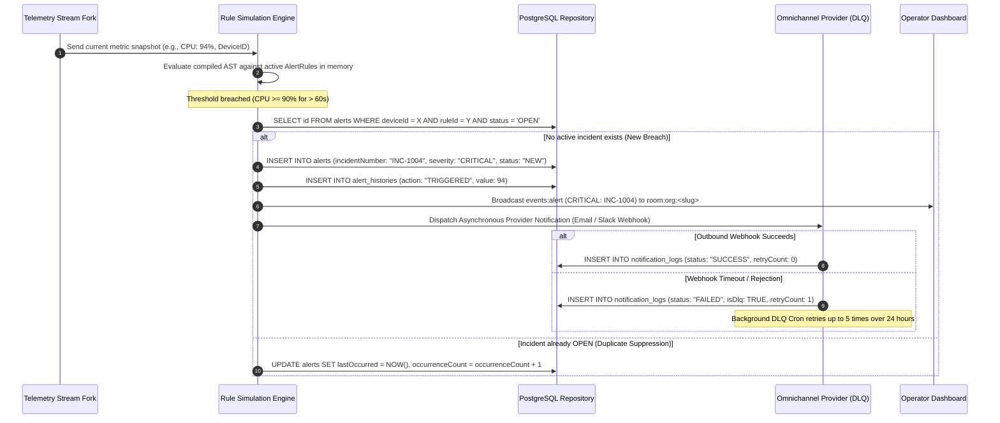
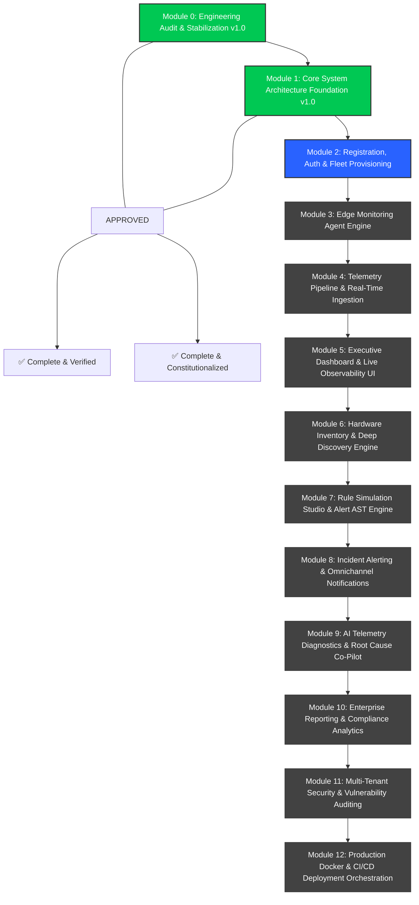

# NOS Operational Specifications, Protocols & Resilience Matrix v1.0

This specification bridges high-level architectural models with low-level runtime execution. It establishes explicit versioned wire protocols, an exhaustive event catalogue, deterministic failure behavior, end-to-end Sequence Diagrams, measurable Non-Functional Requirements (NFRs), and the implementation roadmap for Modules 2–12.

---

## 1. Versioned Agent Wire Protocol (v1.0)

To guarantee backward compatibility and eliminate implicit assumptions during upgrades between edge monitoring daemons (`apps/agent`) and the ingestion gateway (`apps/backend`), all HTTP interaction strictly enforces **NOS Protocol Version 1**.

### 1. Mandatory HTTP Request Headers

Every request emitted by an edge agent must embed the following protocol headers:

```http
POST /api/v1/telemetry/snapshot HTTP/1.1
Host: api.nos.internal
Authorization: Bearer <opaque-device-token>
X-NOS-Protocol-Version: 1.0
X-NOS-Agent-Version: 1.0.4
X-NOS-Schema-Version: 2026-07-01
X-NOS-Capabilities: win-wmi,linux-sysfs,smart-disk,bitlocker-scan
Content-Type: application/json
Content-Encoding: gzip
X-Correlation-ID: cor-7a91-4e82-b9a1-0f11a8b27712
```

| Header Name                  | Type / Format         | Purpose & Ingestion Gateway Validation Rule                                                                                                       |
| :--------------------------- | :-------------------- | :------------------------------------------------------------------------------------------------------------------------------------------------ |
| **`Authorization`**          | `Bearer <hash-token>` | Opaque cryptographic device token (or `X-Registration-Key` during initial onboarding). Checked against salted database hashes.                    |
| **`X-NOS-Protocol-Version`** | `Major.Minor` (`1.0`) | Specifies wire framing rules. If major version is unsupported (> 1.x), server rejects immediately with HTTP `426 Upgrade Required`.               |
| **`X-NOS-Agent-Version`**    | SemVer (`1.0.4`)      | Tracks active firmware deployments. Used by backend to trigger Over-The-Air (OTA) binary updates if below minimum security floor.                 |
| **`X-NOS-Schema-Version`**   | Date (`YYYY-MM-DD`)   | Identifies JSON payload interface DTO version from `@nos/shared-types`.                                                                           |
| **`X-NOS-Capabilities`**     | Comma-delimited list  | Communicates enabled sensor collectors (e.g., `gpu-nvidia`, `docker-socket`, `bitlocker-scan`). Backend never interrogates disabled capabilities. |

### 2. Server Response Headers & Dynamic Instructions

Every successful ingestion response (HTTP 200/201) returns control headers to adjust daemon behavior dynamically without redeployment:

- **`X-NOS-Heartbeat-Interval`**: Integer in seconds (default `30`). Instructs agent on check-in frequency.
- **`X-NOS-Telemetry-Interval`**: Integer in seconds (default `5`). Instructs agent on resource KPI metric sampling rate.
- **`X-NOS-Command-Status`**: `NORMAL` | `MAINTENANCE` | `OTA_UPDATE_REQUIRED`. Instructs finite state machine transitions.

### 3. Compatibility & Deprecation Rules

- **Backward Compatibility**: Ingestion gateways must sustain support for at least **2 previous minor protocol versions** (e.g., v1.2 server supports v1.0 and v1.1 agents).
- **Deprecation Schedule**: When a schema or protocol version is marked for deprecation, gateways inject warning headers (`X-NOS-Deprecation-Warning: Sunset-2026-12-31`). On Sunset date, route handlers return HTTP `410 Gone` with instructions to initiate emergency OTA upgrading.

---

## 2. Formal System Event Catalogue

Every asynchronous domain mutation across the repository maps to an explicit event definition. Zero undocumented events are permitted.

| Event Name               | Publisher Module | Consumer / Subscriber        | Payload DTO Structure                                          | Freq. | Persistence Target          | Retry & DLQ Behavior                                                                                         |
| :----------------------- | :--------------- | :--------------------------- | :------------------------------------------------------------- | :---- | :-------------------------- | :----------------------------------------------------------------------------------------------------------- |
| **`DeviceRegistered`**   | `device`         | `fleet`, `audit`, `realtime` | `{ deviceId, hostname, tenantId, timestamp }`                  | Low   | `audit_logs`, `devices`     | 3 immediate retries; dead-letter log to `audit_logs` on failure.                                             |
| **`HeartbeatReceived`**  | `device`         | `realtime`, `dashboard`      | `{ deviceId, status: "ONLINE", timestamp }`                    | 30s   | `heartbeats` (SetNull)      | Fire-and-forget; no retries (next check-in refreshes state in 30s).                                          |
| **`TelemetryReceived`**  | `telemetry`      | `alerts`, `realtime`         | `{ deviceId, cpuUsage, ramUsage, diskUsage, timestamp }`       | 5s    | `telemetry_snapshots`       | Buffered in agent disk FIFO queue during outages; no server-side broadcast retries.                          |
| **`AlertTriggered`**     | `alerts`         | `realtime`, `notifications`  | `{ alertId, incidentNumber, deviceId, severity, metricValue }` | Event | `alerts`, `alert_histories` | Asynchronous worker exponential backoff (5 retries over 24h); fallback to `notification_logs (isDlq: true)`. |
| **`AlertResolved`**      | `alerts`         | `realtime`, `notifications`  | `{ alertId, resolvedBy, reason, timestamp }`                   | Event | `alerts`, `audit_logs`      | Same as `AlertTriggered`.                                                                                    |
| **`DeviceOffline`**      | `health`         | `alerts`, `realtime`         | `{ deviceId, hostname, lastSeen, timestamp }`                  | Event | `alerts`, `audit_logs`      | Guaranteed 3 retries to notification provider; permanent record in device timeline.                          |
| **`MaintenanceStarted`** | `fleet`          | `agent`, `alerts`            | `{ windowId, deviceIds: [], durationMinutes }`                 | Low   | `maintenance_windows`       | Broadcast via response header instruction on next heartbeat check-in.                                        |
| **`MaintenanceEnded`**   | `fleet`          | `agent`, `alerts`            | `{ windowId, timestamp }`                                      | Low   | `maintenance_windows`       | Broadcast via response header instruction on next heartbeat check-in.                                        |
| **`InventoryUpdated`**   | `inventory`      | `realtime`, `audit`          | `{ deviceId, assetFingerprint, diffs: [] }`                    | 15m   | `device_inventories`        | Agent retries snapshot push every 15m until 200 OK receipt.                                                  |
| **`PolicyApplied`**      | `tenant`         | `agent`, `audit`             | `{ policyId, tenantId, rules: [] }`                            | Low   | `audit_logs`                | Synchronous confirmation required during operator mutation request.                                          |
| **`SoftwareInstalled`**  | `inventory`      | `alerts`, `audit`            | `{ deviceId, packageName, version, publisher }`                | Low   | `audit_logs`                | Recorded during deep scan diff discovery; no secondary retries needed.                                       |
| **`DiskLow`**            | `alerts`         | `realtime`, `notifications`  | `{ deviceId, driveName, freeBytes, totalBytes }`               | Event | `alerts`                    | Same as `AlertTriggered`.                                                                                    |
| **`CPUHigh`**            | `alerts`         | `realtime`, `notifications`  | `{ deviceId, utilization: number, durationSeconds }`           | Event | `alerts`                    | Same as `AlertTriggered`.                                                                                    |
| **`MemoryHigh`**         | `alerts`         | `realtime`, `notifications`  | `{ deviceId, utilization: number, availableBytes }`            | Event | `alerts`                    | Same as `AlertTriggered`.                                                                                    |

---

## 3. Comprehensive Component Failure Matrix

To eliminate guessing during infrastructure degradation, every subsystem strictly adheres to the following deterministic failure behaviors:



### Tabular Remediation Summary:

1. **Database Unavailable**: Backend ORM connection pools terminate active queries with `503 Service Unavailable`. API endpoints cease processing mutations. Edge monitoring agents detect 503s and instantly divert diagnostic telemetry into their local encrypted disk FIFO buffer without dropping critical hardware logs.
2. **Backend Unavailable**: When API gateways drop off the network, edge agents enter `Network_Offline` state, logging metrics locally while executing capped exponential backoff reconnect loops (5s -> 15s -> 30s -> 60s max).
3. **Socket Disconnected**: If an operator browser loses TCP WebSocket connection to `/ws`, the Next.js UI triggers an immediate amber warning banner ("Real-time Connection Severed - Retrying..."). Upon socket restabilization, the client utility automatically issues a synchronous REST request (`GET /api/v1/alerts?status=NEW`) to reconcile any alerts generated during the offline window before resuming streaming.
4. **Agent Loses Internet**: Edge target machines isolated from WAN communication continue internal collector loops. Telemetry writes to a bounded 50 MB local SQLite/JSON FIFO queue on disk. If the 50 MB disk ceiling is breached, the oldest historical snapshots are purged to prevent saturating target hard drives. When WAN restores, queued snapshots flush sequentially in chronological batches.
5. **Registration Key Revoked**: Attempting to onboard a node using a revoked or expired key (`POST /api/v1/device/register`) triggers an immediate HTTP `401 Unauthorized` / `403 Forbidden`. The agent logs a fatal enrollment exception, terminates its service thread, and halts execution permanently until a system admin injects a new deployment key.
6. **JWT Expired**: When a frontend operator's 15-minute access token expires, API controllers respond with HTTP `401 Unauthorized`. The Axios/Fetch HTTP interface wrapper (`lib/api-client.ts`) intercepts this status, transparently submitting the secure refresh token to `POST /api/v1/auth/refresh`. If valid, the replacement access JWT is cached, and the original failed HTTP request re-executes seamlessly without user interruption. If the refresh token is expired or revoked, client state resets and the user is redirected to `/login`.

---

## 4. End-to-End Sequence Diagrams

### 1. Device Registration Workflow



### 2. Telemetry Ingestion & Real-Time Stream Workflow



### 3. Alert Evaluation, Incident Triggering & Notification Workflow



---

## 5. Measurable Non-Functional Requirements (NFRs)

To reject vague assertions like "fast" or "scalable", all implementations from Module 2 onward are bound by strict, testable numeric targets:

| Metric Dimension         | Target Threshold (Mandatory SLA)                                                         | Verification Method & Test Gate                                                         |
| :----------------------- | :--------------------------------------------------------------------------------------- | :-------------------------------------------------------------------------------------- |
| **Heartbeat Frequency**  | Exactly every **30 seconds** (±500ms jitter tolerance)                                   | Validated via network trace profiling in simulated worker environments.                 |
| **Telemetry Frequency**  | Exactly every **5 seconds** per active node                                              | Validated via ingestion controller timing checkpoints.                                  |
| **Dashboard UI Latency** | **< 1.0 second** Time-To-Interactive (TTI); **< 50ms** WebSocket stream paint            | Checked via Google Chrome Lighthouse audit and Recharts canvas rendering profiler.      |
| **Registration Latency** | **< 3.0 seconds** total enrollment handshake completion                                  | Measured from initial `POST /api/v1/device/register` invocation to token return.        |
| **Reconnect Recovery**   | **< 30 seconds** max backoff window after network cut                                    | Automated test simulation simulating network drops and socket reconnect loops.          |
| **WebSocket Scale**      | Sustain **10,000 concurrent client TCP connections** per clustered gateway instance      | Verified via Node.js Socket.io benchmarking tools (`loadtest`, `artillery`).            |
| **Database Ingestion**   | Minimum **100 continuous telemetry snapshot inserts / sec / core** without lock blocking | Measured via Prisma batch insert throughput benchmarks in Operational Acceptance tests. |

---

## 6. Visual Module Dependency Roadmap

To maintain rigorous development discipline, future implementation progresses through an immutable sequential sequence. No future module may commence until the preceding module's unit tests, operational acceptance tests, and Definition of Done are verified in production working code:



---

## 7. Mandatory Implementation Governance Rule (Module 2+)

> [!IMPORTANT]
> **CONSTITUTIONAL CODING MANDATE FOR MODULES 2 THROUGH 12**  
> From Module 2 onward, every feature implementation must satisfy this immutable rule:  
> **Write the smallest amount of documentation necessary to keep the implementation aligned with the architecture. Prioritize working, tested code over expanding the documentation set.**  
> The emphasis now shifts entirely from theoretical architecture documents to building the system incrementally while continuously validating every pull request against these established quality gates.

---

## 8. Module 3 Architecture & Operational Constitutional Mandates

To ensure enterprise scalability and strict bounded module responsibilities, the following architectural mandates govern Module 3 (Live Telemetry, Inventory & Device Operations) and all downstream extensions:

### 1. Separation of Heartbeat and Telemetry

- **Heartbeat (Every 30 seconds)**: Dedicated lightweight lifecycle pulse answering _"Is the agent alive?"_. Contains only `timestamp`, `agentVersion`, `uptime`, and `lastTelemetryId`. **Presence (`ONLINE` vs `OFFLINE`) relies exclusively on Heartbeat check-ins.** Never couple UI status or presence logic to telemetry streams.
- **Telemetry (Every 5 seconds)**: Continuous diagnostic metric stream answering _"What is happening?"_. Collects real hardware performance parameters (CPU, RAM, Disk throughput, Network interfaces, running processes, Windows services, boot time, Gateway, DNS) via native OS APIs without mock calculations or RNG.

### 2. Versioned Inventory Snapshots & Audit Diff Engine

- Every inventory transmission (cycled every 15 minutes or on-demand) follows the strict snapshot lifecycle: `Inventory Snapshot -> Fingerprint -> Compare -> Version -> Audit -> Current`.
- Each upload produces a distinct `version` and cryptographic hash (`assetFingerprint`). If a diff is discovered, immutable diff entries are appended to `inventory_audit_logs`.
- Agent collection architecture must employ separated component collectors (`CPUCollector`, `MemoryCollector`, `DiskCollector`, `GPUCollector`, `NICCollector`, `OSCollector`, `ServiceCollector`, `SoftwareCollector`, `SecurityCollector`), combined via an orchestration `InventoryAggregator`.

### 3. Telemetry Retention & Aggregation Strategy

- To safeguard PostgreSQL database storage from explosion under high-frequency continuous telemetry ingestion, persistence layer enforces automated tiered retention:
  - **Raw 5-second Snapshots**: Retained for **24 hours**.
  - **1-minute Aggregations**: Retained for **30 days**.
  - **15-minute Aggregations**: Retained for **180 days**.
  - **Daily Aggregations**: Retained indefinitely for baseline SLA modeling.

### 4. Operator Commands & Rule 4 Compliance

- Operational control actions within the Device details UI (such as remote scripting or terminal control) that belong to future module implementations must be rendered as **Visible, Disabled buttons with an explicit tooltip reading "Available in Module 6"**. Under no circumstances may 404s, blank placeholder pages, or "Coming Soon" banners be utilized.

### 5. Standard WebSocket Event Envelope

- All real-time broadcasts via Socket.IO gateways (`telemetry.updated`, `inventory.updated`, `status.changed`, `heartbeat.received`) must conform to a unified canonical payload envelope:
  ```json
  {
    "eventId": "evt-uuid-v4",
    "eventType": "telemetry.updated",
    "timestamp": "2026-07-28T20:45:00.000Z",
    "organizationId": "org-slug",
    "deviceId": "dev-uuid-v4",
    "correlationId": "cor-uuid-v4",
    "payload": { ... }
  }
  ```

### 6. Internal Domain Event Bus Architecture

- Direct service-to-service synchronous coupling for operational cross-cutting concerns is prohibited. Module implementations must leverage an internal event bus (`@nestjs/event-emitter` or equivalent domain event publisher) to broadcast mutations (`DeviceHeartbeatEvent`, `TelemetryReceivedEvent`, `InventoryUpdatedEvent`, `StatusChangedEvent`).
- Domain subscribers (`AlertHandler`, `TimelineHandler`, `RealtimeHandler`, `AnalyticsHandler`) react autonomously to domain emissions. In particular, **Device Operational Timeline** insertions occur solely via domain event subscriptions rather than direct repository calls from API controllers.

### 7. Asynchronous Fleet Bulk Operations & Job Tracking

- Batch commands across multiple devices (`PATCH /api/v1/device/bulk`) must operate asynchronously via job tracking structures, returning immediate submission confirmations: `{ jobId, accepted, queued, estimatedDevices }`.
- Status interrogation is supported via `GET /api/v1/device/jobs/:jobId` to guarantee non-blocking operational response times as fleet deployment scaling exceeds hundreds of endpoints.

### 8. Bounded Semantic & Parameter Search

- Global device search endpoints (`GET /api/v1/device/search`) strictly bound indexing and evaluation to defined operational parameter fields: `Hostname`, `UUID`, `IP`, `MAC`, `OS`, `Tag`, `Location`, `User`, `SerialNumber`, `InstalledSoftware`, and `DeviceGroup`. Unbounded wildcard scanning is strictly restricted.
