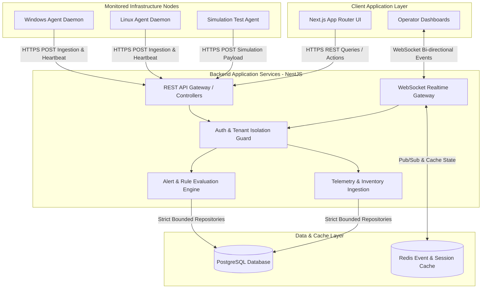

# NOS System Architecture & Constitutional Core v1.0

This document is the **Constitutional Document** of the Neural Operating System (NOS) repository. Every future module, pull request, architectural design, and implementation must strictly comply with the architectural rules and structural foundations defined herein. 

In adherence to the **Zero Guess Policy** and real codebase inspection constraints, every design decision in this document is anchored in existing stable infrastructure (`apps/backend`, `apps/frontend`, `apps/agent`, `packages/shared-types`). Existing stable code takes precedence over idealized redesigns unless there is a measurable architectural, security, scalability, or maintainability justification to alter it.

---

## 1. Immutable Global Constitutional Rules

These rules override all future prompts, feature requests, and individual component specifications:

| Rule | Constitutional Mandate | Enforced Engineering Rationale |
| :--- | :--- | :--- |
| **Rule 1** | **Never generate code before defining architecture.** | Unarchitected features introduce tech debt, schema drift, and security regressions. Architecture Decision Records (ADRs) and architectural design specifications precede implementation. |
| **Rule 2** | **Every folder has exactly one responsibility.** | No dumping logic into miscellaneous directories (`utils/`, `common/`, `misc/` without cohesive scope). Clean architecture layer boundaries must be evident in directory naming. |
| **Rule 3** | **No circular dependencies.** | Module A may depend on Module B; Module B must never depend on Module A. Directed Acyclic Graphs (DAG) must be enforced across modules, packages, and components. |
| **Rule 4** | **Every API has exactly one documented owner.** | Endpoints must be explicitly owned by a dedicated bounded context module in the backend. Cross-domain mutations must communicate via application services or event streams, not unowned controller hacks. |
| **Rule 5** | **Every database table has exactly one owning module.** | Tables defined in `schema.prisma` belong to a specific backend domain module. Other modules must not query or mutate foreign tables directly via repository bypassing. |
| **Rule 6** | **Frontend never accesses database directly.** | All data presentation and mutations occur strictly through documented REST or WebSocket APIs emitted by `apps/backend`. Zero direct client-to-database connections. |
| **Rule 7** | **Agent never knows the database.** | `apps/agent` functions as an autonomous endpoint sensor. It interacts solely with validated ingestion APIs (`/api/v1/device/*`, `/api/v1/telemetry/*`). It holds zero database credentials or schemas. |
| **Rule 8** | **Dashboard never communicates with agent.** | The frontend UI does not establish direct connections to managed target hosts or desktop daemons. All real-time telemetry and management instructions pass through `apps/backend` broker gateways. |
| **Rule 9** | **Nothing uses fake data.** | Zero synthetic data generation in production flows. No `Math.random()`, placeholder mock services, static CPU percentages, or unbacked tables. Everything rendered stems from verified domain truth. |
| **Rule 10** | **Every decision justifies Problem, Reason, Alternatives, Trade-offs, Decision, Impact.** | Architectural changes must state current implementation state, why it fails engineering requirements, and the measurable benefits of transformation. |

---

## 2. High-Level Macro Architecture Diagram

The system topology implements a strict **3-Tier Distributed Sensor & SaaS Engine** architecture:

---

## 3. Alignment with Existing Codebase & Migration Principles

### Current Implementation Assessment
An exhaustive physical review of the repository demonstrates an already mature structural foundation:
- **Backend**: Structured under `apps/backend` using NestJS with cohesive bounded modules (`alerts`, `auth`, `dashboard`, `device`, `fleet`, `health`, `inventory`, `realtime`, `telemetry`, `tenant`, `users`).
- **Frontend**: Located under `apps/frontend` using Next.js App Router, partitioned cleanly into feature modules (`features/alerts`, `features/device`, etc.) that query backend endpoints.
- **Monitoring Agent**: Located under `apps/agent` as a clean C# .NET background worker implementing Dependency Injection via platform collectors (`IMetricCollector`).
- **Shared Infrastructure**: Monorepo packages (`packages/shared-types`) ensure single-source-of-truth TypeScript contract synchronization across frontend and backend boundaries.

### Architectural Grounding & Preservation Principle
Rather than proposing theoretical rewrites or speculative abstraction layers:
1. **Existing Module Boundaries**: Existing domain folders in `apps/backend/src/modules` are formalized as immutable bounded contexts.
2. **Existing Telemetry DI**: The established `IMetricCollector` pattern in `apps/agent` is solidified as the permanent architectural sensor abstraction.
3. **Database Single Truth**: The existing 37 Prisma entity models in `apps/backend/prisma/schema.prisma` are strictly assigned domain owners without destructive table transformations.
