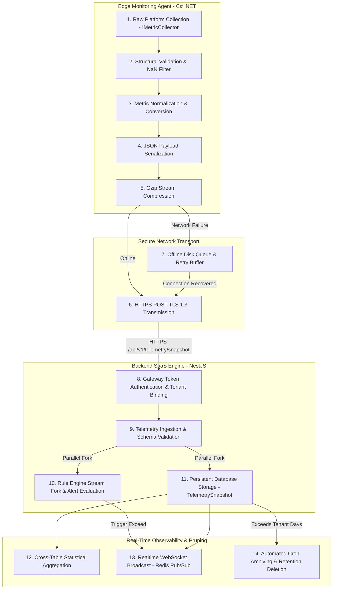

# NOS Telemetry Pipeline & Realtime WebSocket Architecture v1.0

This document defines the high-performance telemetry processing pipeline and real-time WebSocket communication infrastructure of the Neural Operating System (NOS). Designed to process high-frequency hardware diagnostics across scalable infrastructure fleets, this architecture enforces strict Separation of Concerns and data verification in compliance with **Global Rule 6** ("Frontend never accesses database directly"), **Global Rule 8** ("Dashboard never communicates with agent"), and **Global Rule 9** ("Nothing uses fake data").

---

## 1. Complete End-to-End Telemetry Ingestion Pipeline

The telemetry stream manages the journey of performance metrics from physical hardware sensors to permanent database retention storage and real-time dashboard presentation through a disciplined **14-Stage Ingestion Pipeline**:

---

### Pipeline Stage Technical Specifications

| Stage  | Name                     | Owning Layer   | Implementation & Engineering Mandate                                                                                                                                                                | Failure Mitigation & Quality Rules                                                                                              |
| :----- | :----------------------- | :------------- | :-------------------------------------------------------------------------------------------------------------------------------------------------------------------------------------------------- | :------------------------------------------------------------------------------------------------------------------------------ |
| **1**  | **Collection**           | `apps/agent`   | Platform-specific singletons (`WindowsMetricCollector`, `LinuxMetricCollector`) sample raw operating system performance counters, `/proc/stat`, and sysfs hardware handles.                         | **Rule 1 & 2**: No random generated data or WMI hardcoding. Fallbacks must error rather than invent metrics.                    |
| **2**  | **Validation**           | `apps/agent`   | Local agent screening detects divide-by-zero Infinity results, NaN values, or out-of-bounds readings (e.g., RAM usage reporting >100%).                                                             | Erroneous metric readings are stripped; log entry emitted to agent diagnostic trace.                                            |
| **3**  | **Normalization**        | `apps/agent`   | Converts disparate OS data units into standardized SI metric units (bytes for storage/memory, fractional percentages for CPU utilization, seconds for uptime).                                      | Guarantees backend storage schema consistency across heterogeneous operating systems.                                           |
| **4**  | **Serialization**        | `apps/agent`   | Compiles validated metrics into immutable JSON payloads synchronized with `@nos/shared-types` interface structures.                                                                                 | JSON formatting errors trip local serialization exceptions without network transmission.                                        |
| **5**  | **Compression**          | `apps/agent`   | Applies standard HTTP Gzip compression (`Content-Encoding: gzip`) to JSON stream bodies exceeding 1 KB in payload volume.                                                                           | Reduces cellular/edge bandwidth footprint by ~85%. Bypassed for small single heartbeats.                                        |
| **6**  | **Transport**            | `apps/agent`   | Transmits secure HTTPS POST requests over TLS 1.3 directly to `apps/backend` ingestion endpoints.                                                                                                   | Strictly forbids insecure unencrypted HTTP connections in production runtime profiles.                                          |
| **7**  | **Offline Queue**        | `apps/agent`   | When backend ingestion endpoints return 5xx errors or network disconnection occurs, serialized metric payloads write to local encrypted disk FIFO queue.                                            | Queue depth capped at 50 MB (oldest purged on exhaustion). Flushes via exponential backoff upon connection recovery.            |
| **8**  | **Authentication**       | `apps/backend` | NestJS `AuthGuard` evaluates incoming Bearer tokens or Registration Key headers against indexed database cryptographic hashes (`devices.tokenHash`).                                                | Unverified, malformed, or revoked credentials rejected immediately with `401 Unauthorized` before body parsing.                 |
| **9**  | **Ingestion**            | `apps/backend` | `telemetry` domain module parses decompressed JSON stream against NestJS class-validator decorators and DTO schemas.                                                                                | Malformed schema entries dropped with `400 Bad Request`; offender IP recorded in security logs.                                 |
| **10** | **Rule Evaluation**      | `apps/backend` | Stream splits into `alerts` domain processor; executes memory-cached `AlertRule` AST evaluations (`RuleSimulationService`) against incoming metrics in sub-millisecond cycles.                      | Rule evaluation exceptions are caught and isolated; failure in threshold alerting never prevents raw data database persistence. |
| **11** | **Storage**              | `apps/backend` | `PrismaService` executes asynchronous batch inserts into PostgreSQL `telemetry_snapshots` table, binding records to parent `deviceId`.                                                              | DB lock contention managed via connection pool throttling and prepared statements.                                              |
| **12** | **Aggregation**          | `apps/backend` | `dashboard` module compiles time-bucketed historical averages (hourly/daily CPU/RAM histograms) for instant UI dashboard rendering.                                                                 | Read-only statistical aggregation; never modifies underlying historical raw rows.                                               |
| **13** | **Visualization**        | `apps/backend` | `realtime` WebSocket Gateway publishes sanitized metric update pulses to active Redis Pub/Sub channels (`events:telemetry`).                                                                        | Broadcast is purely unidirectional from backend to subscribed browser UI; agents never communicate directly with UI screens.    |
| **14** | **Archiving & Deletion** | `apps/backend` | Scheduled background task executes scheduled daily cleanup, pruning `telemetry_snapshots` rows whose timestamp exceeds the hosting organization's retention window (`organizations.retentionDays`). | Ensures compliance with data privacy regulations and prevents infinite database table disk saturation.                          |

---

## 2. Real-Time WebSocket Infrastructure Architecture

To power instant dashboard responsiveness without polling overhead, NOS provides an enterprise real-time event broker located in `apps/backend/src/modules/realtime/`.

### 1. WebSocket Gateway & Room Topology

- **Namespace**: All real-time sockets connect via the centralized `/ws` namespace.
- **Multi-Tenant Room Isolation**: Upon connection upgrade, client session JWTs are cryptographically validated. Clients are strictly assigned to an isolated Redis Socket Room derived from their verified identity: `room:org:<organizationId>`. A tenant user can never join or intercept telemetry broadcast streams belonging to a different organization.

### 2. Supported Real-Time Event Catalog

| Event Name                  | Publisher Domain   | Subscriber Consumer       | Payload Schema Structure                                                                                                | Trigger Conditions & Delivery Quality                                                                         |
| :-------------------------- | :----------------- | :------------------------ | :---------------------------------------------------------------------------------------------------------------------- | :------------------------------------------------------------------------------------------------------------ |
| **`events:device_status`**  | `device` Module    | Connected UI (`frontend`) | `{ deviceId: string, hostname: string, status: "ONLINE" \| "OFFLINE" \| "DEGRADED", timestamp: string }`                | Emitted immediately when a device checks in via heartbeat or misses 3 consecutive poll windows.               |
| **`events:telemetry`**      | `telemetry` Module | Connected UI (`frontend`) | `{ deviceId: string, cpuUsage: number, ramUsage: number, timestamp: string }`                                           | Throttled stream pulse emitted maximum once per 5 seconds per device to prevent frontend DOM render flooding. |
| **`events:alert`**          | `alerts` Module    | Connected UI (`frontend`) | `{ alertId: string, incidentNumber: string, severity: string, title: string, deviceId: string, status: string }`        | High-priority immediate dispatch whenever a telemetry stream breaches an active `AlertRule` threshold.        |
| **`events:inventory_diff`** | `inventory` Module | Connected UI (`frontend`) | `{ deviceId: string, assetFingerprint: string, changes: Array<{ component: string, oldVal: string, newVal: string }> }` | Broadcast when a device reports a hardware configuration mutation (e.g., RAM removal or USB insertion).       |

---

### 3. Connection Resiliency, Compression & Backpressure

1. **Per-Message Compression**: Sockets negotiate per-message DEFLATE compression extensions (`permessage-deflate`), reducing real-time JSON payload wire sizes by up to 75% across active fleet dashboards.
2. **Backpressure & Flood Control**: If a frontend UI browser tabs loses focus or connection latency drops processing speed, the Node.js Socket Gateway monitors outgoing buffer queue depths. If client backpressure exceeds 10 MB, intermediate high-frequency `events:telemetry` frames are silently dropped in favor of delivering newest snapshots and critical `events:alert` incident notifications.
3. **Offline Client Recovery**: When an operator re-connects after transient disconnection, the frontend client initiates an immediate REST state reconciliation query (`GET /api/v1/alerts?status=NEW`) to synchronize any incidents missed during the socket offline window before resuming real-time stream consumption.
